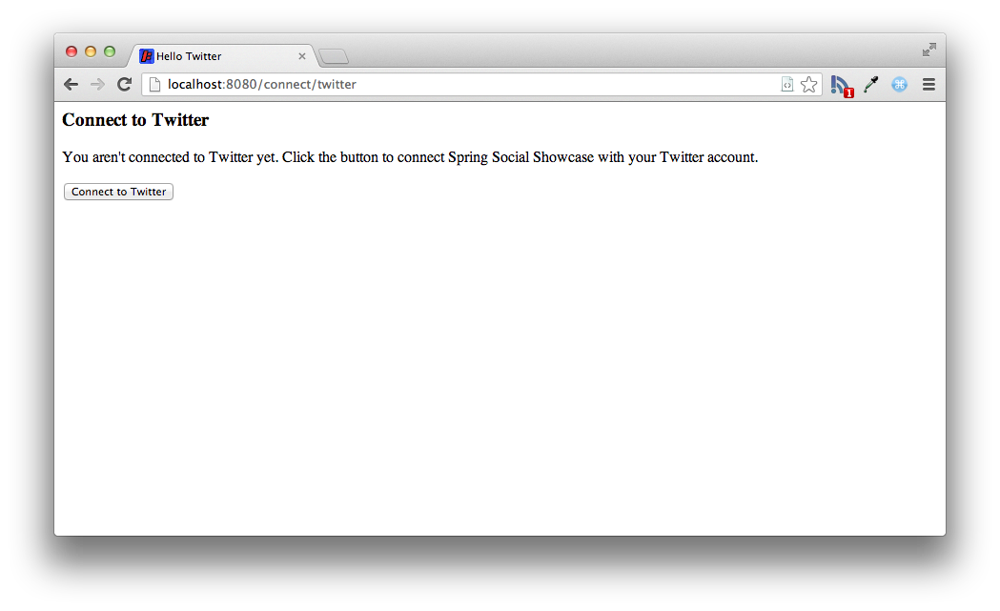
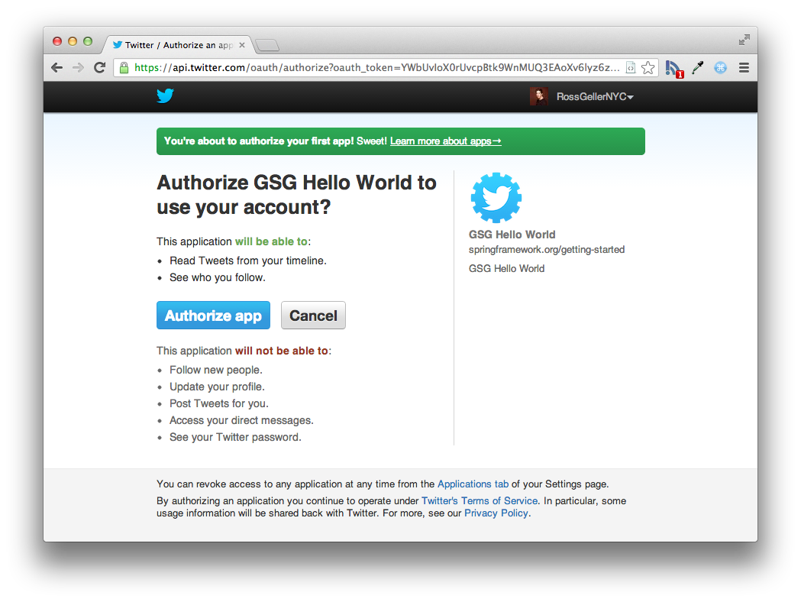
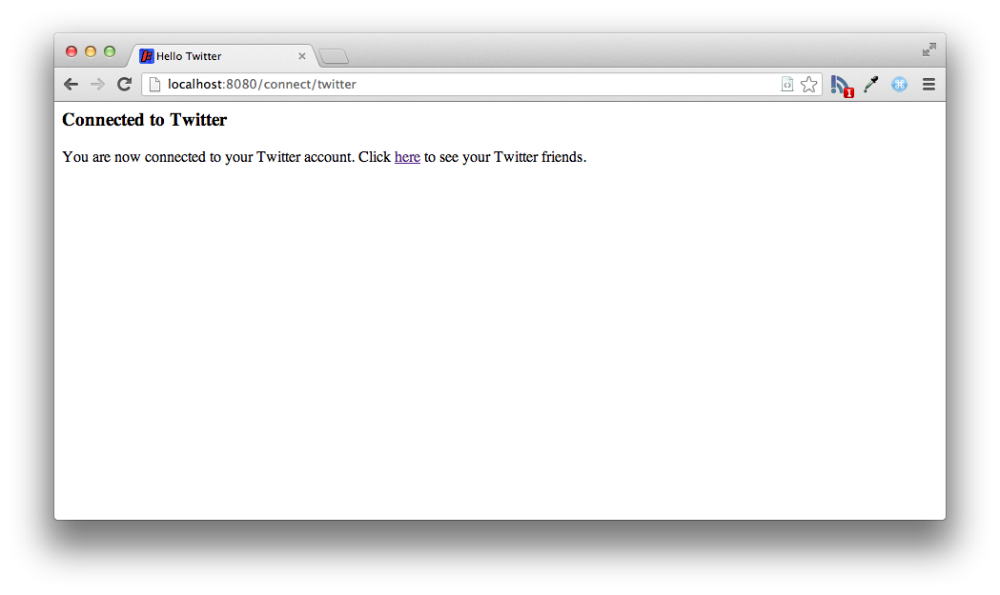
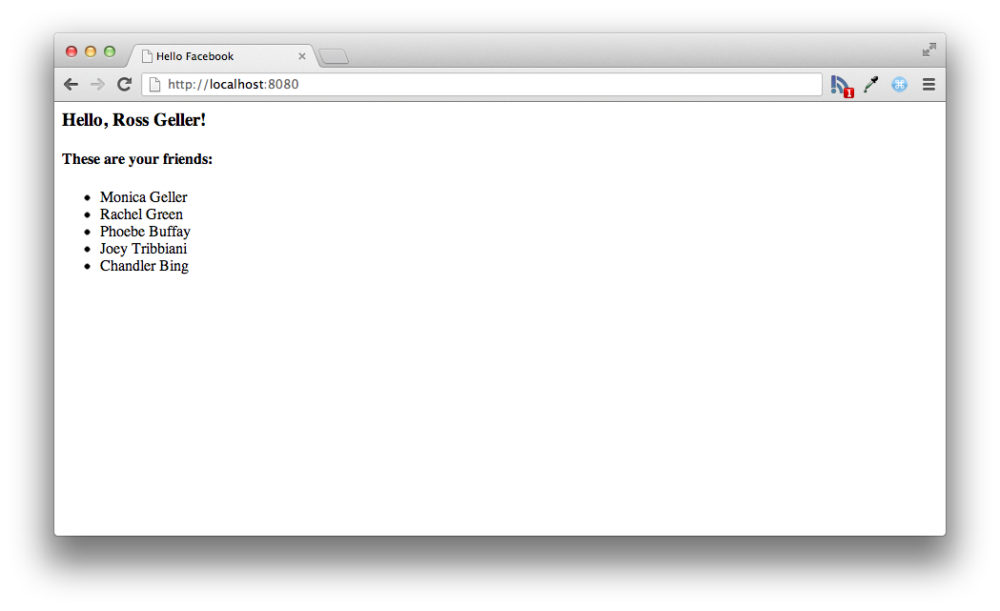

:spring_version: current
:toc:
:spring_boot_version: 1.3.3.RELEASE
:spring_social_twitter_version: current
:spring_security_version: current
:EnableTwitter: http://docs.spring.io/spring-social-twitter/docs/{spring_social_twitter_version}/api/org/springframework/social/twitter/config/annotation/EnableTwitter.html
:EnableJdbcConnectionRepository: http://docs.spring.io/spring-social/docs/{spring_social_twitter_version}/api/org/springframework/social/config/annotation/EnableJdbcConnectionRepository.html
:SecurityContext: http://docs.spring.io/spring-security/site/docs/{spring_security_version}/apidocs/org/springframework/security/core/context/SecurityContext.html
:DispatcherServlet: http://docs.spring.io/spring/docs/{spring_version}/javadoc-api/org/springframework/web/servlet/DispatcherServlet.html
:SpringApplication: http://docs.spring.io/spring-boot/docs/{spring_boot_version}/api/org/springframework/boot/SpringApplication.html
:ConnectionRepository: http://docs.spring.io/spring-social/docs/{spring_social_twitter_version}/api/org/springframework/social/connect/ConnectionRepository.html
:Authentication: http://docs.spring.io/spring-security/site/docs/{spring_security_version}/apidocs/org/springframework/security/core/Authentication.html
:ConnectController: http://docs.spring.io/spring-social/docs/{spring_social_twitter_version}/api/org/springframework/social/connect/web/ConnectController.html
:ConnectionFactoryLocator: http://docs.spring.io/spring-social/docs/{spring_social_twitter_version}/api/org/springframework/social/connect/ConnectionFactoryLocator.html
:gs-register-twitter-app: link:/guides/gs/register-twitter-app
:icons: font
:source-highlighter: prettify
:project_id: gs-accessing-twitter
This guide walks you through the process of creating a simple web application that fetches data from Twitter. 

== What you'll build

You'll learn how to build a Spring application that accesses profile data from a Twitter user and from people whom the user follows on Twitter.

== What you'll need

:java_version: 1.8
include::https://raw.githubusercontent.com/spring-guides/getting-started-macros/master/prereq_editor_jdk_buildtools.adoc[]
+
- An application ID and secret obtained from {gs-register-twitter-app}[registering an application with Twitter].

include::https://raw.githubusercontent.com/spring-guides/getting-started-macros/master/how_to_complete_this_guide.adoc[]

include::https://raw.githubusercontent.com/spring-guides/getting-started-macros/master/hide-show-gradle.adoc[]

include::https://raw.githubusercontent.com/spring-guides/getting-started-macros/master/hide-show-maven.adoc[]

include::https://raw.githubusercontent.com/spring-guides/getting-started-macros/master/hide-show-sts.adoc[]

[[initial]]
== Enable Twitter
Before you can fetch a user's data from Twitter, you must specify your application's ID and secret by setting the `spring.social.twitter.appId` and `spring.social.twitter.appSecret` properties. You can set these via any means supported by Spring Boot, including setting them in an `application.properties` file:

`src/main/resources/application.properties`
[source,properties]
----
include::complete/src/main/resources/application.properties[]
----

As shown here, the properties have fake values. The values given to these properties correspond to your application's consumer key and secret you obtain when you {gs-register-twitter-app}[register the application with Twitter]. For the code to work, substitute the real values given to you by Twitter in place of the fake values.

The presence of these properties and Spring Social Twitter in the classpath will trigger automatic configuration of Spring Social's `ConnectController`, `TwitterConnectionFactory`, and other components of Spring Social's connection framework.

== Create connection status views
Although much of what `ConnectController` does involves redirecting to Twitter and handling a redirect from Twitter, it also shows connection status when a GET request to /connect is made. `ConnectController` defers to a view named connect/{provider ID}Connect when no existing connection is available and to connect/{providerId}Connected when a connection exists for the provider. In this case, {provider ID} is "twitter".

`ConnectController` does not define its own connection views, so you need to create them. First, here's a Thymeleaf view to be shown when no connection to Twitter exists:

`src/main/resources/templates/connect/twitterConnect.html`
[source,html]
----
include::complete/src/main/resources/templates/connect/twitterConnect.html[]
----

The form on this view will POST to /connect/twitter, which is handled by `ConnectController` and will kick off the OAuth authorization code flow.

Here's the view to be displayed when a connection exists:

`src/main/resources/templates/connect/twitterConnected.html`
[source,html]
----
include::complete/src/main/resources/templates/connect/twitterConnected.html[]
----

== Fetch Twitter data
With Twitter configured in your application, you now can write a Spring MVC controller that fetches data for the user who authorized the application and presents it in the browser. `HelloController` is just such a controller:

`src/main/java/hello/HelloController.java`
[source,java]
----
include::complete/src/main/java/hello/HelloController.java[]
----

`HelloController` is created by injecting a `Twitter` object into its constructor. The `Twitter` object is a reference to Spring Social's Twitter API binding.

The `helloTwitter()` method is annotated with `@RequestMapping` to indicate that it should handle GET requests for the root path (/). The first thing it does is check to see if the user has authorized the application to access the user's Twitter data. If not, then the user is redirected to `ConnectController` with the option to begin the authorization process.

If the user authorizes the application to access the data, the application can fetch almost any data pertaining to the authorizing user. For the purposes of this guide, the application only fetches the user's profile as well as a list of profiles belonging to Twitter users whom the user follows (but not those who follow the user). Both are placed into the model to be displayed by the view identified as "hello".

Speaking of the "hello" view, here it is as a Thymeleaf template:

`src/main/resources/templates/hello.html`
[source,html]
----
include::complete/src/main/resources/templates/hello.html[]
----

This template simply displays a greeting to the user and a list of the user's friends.
Note that even though the full user profiles were fetched, only the names from those profiles are used in this template.

== Make the application executable

Although it is possible to package this service as a traditional link:/understanding/WAR[WAR] file for deployment to an external application server, the simpler approach demonstrated below creates a _standalone application_. You package everything in a single, executable JAR file, driven by a good old Java `main()` method. And along the way, you use Spring's support for embedding the link:/understanding/Tomcat[Tomcat] servlet container as the HTTP runtime, instead of deploying to an external instance.

`src/main/java/hello/Application.java`
[source,java]
----
include::complete/src/main/java/hello/Application.java[]
----

`@SpringBootApplication` is a convenience annotation that adds all of the following:
    
- `@Configuration` tags the class as a source of bean definitions for the application context.
- `@EnableAutoConfiguration` tells Spring Boot to start adding beans based on classpath settings, other beans, and various property settings.
- Normally you would add `@EnableWebMvc` for a Spring MVC app, but Spring Boot adds it automatically when it sees **spring-webmvc** on the classpath. This flags the application as a web application and activates key behaviors such as setting up a `DispatcherServlet`.
- `@ComponentScan` tells Spring to look for other components, configurations, and services in the the `hello` package, allowing it to find the `HelloController`.

The `main()` method uses Spring Boot's `SpringApplication.run()` method to launch an application. Did you notice that there wasn't a single line of XML? No **web.xml** file either. This web application is 100% pure Java and you didn't have to deal with configuring any plumbing or infrastructure.

include::https://raw.githubusercontent.com/spring-guides/getting-started-macros/master/build_an_executable_jar_subhead.adoc[]

include::https://raw.githubusercontent.com/spring-guides/getting-started-macros/master/build_an_executable_jar_with_both.adoc[]

....
... app starts up ...
....

Once the application starts up, you can point your web browser to http://localhost:8080. Because no connection is established yet, you see this screen prompting you to connect with Twitter:

 
When you click **Connect to Twitter**, the browser is redircted to Twitter for authorization:

At this point, Twitter asks if you'd like to allow the sample application to read tweets from your profile and see who you follow. Here the screen is misleading, because the application in this case will only read your profile details and the profile details of the people you follow. Click **Authorize app** to grant permission.

Once permission is granted, Twitter redirects the browser to the application. A connection is created and stored in the connection repository. You should see this page indicating that a connection was successful:

If you click on the link on the connection status page, you are taken to the home page. This time, now that a connection exists, you see your name on Twitter and a list of your friends:

== Summary
Congratulations! You've developed a simple web application that uses Spring Social to obtain user authorization to fetch data from the user's Twitter profile and from the profiles of people whom the user follows.

include::https://raw.githubusercontent.com/spring-guides/getting-started-macros/master/footer.adoc[]

