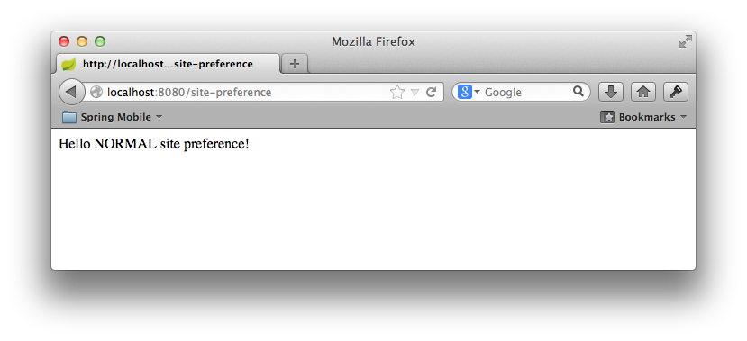
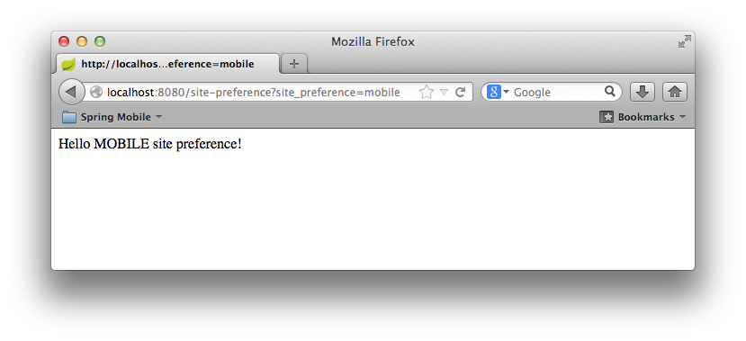

This guide walks you through the process of using Spring to provide a user with the choice of viewing a normal, mobile, or tablet version of your site, regardless of what type of device being used.

What you'll build
-----------------

You will create a Spring Web MVC application that detects the type of device that is accessing your web site and enables functionality to override the default view for the device by selecting an alternate site preference.

What you'll need
----------------

 - About 15 minutes
 - A favorite text editor or IDE
 - [JDK 6][jdk] or later
 - [Gradle 1.8+][gradle] or [Maven 3.0+][mvn]
 - You can also import the code from this guide as well as view the web page directly into [Spring Tool Suite (STS)][gs-sts] and work your way through it from there.

[jdk]: http://www.oracle.com/technetwork/java/javase/downloads/index.html
[gradle]: http://www.gradle.org/
[mvn]: http://maven.apache.org/download.cgi
[gs-sts]: /guides/gs/sts


How to complete this guide
--------------------------

Like all Spring's [Getting Started guides](/guides/gs), you can start from scratch and complete each step, or you can bypass basic setup steps that are already familiar to you. Either way, you end up with working code.

To **start from scratch**, move on to [Set up the project](#scratch).

To **skip the basics**, do the following:

 - [Download][zip] and unzip the source repository for this guide, or clone it using [Git][u-git]:
`git clone https://github.com/spring-guides/gs-mobile-site-preference.git`
 - cd into `gs-mobile-site-preference/initial`.
 - Jump ahead to [Create a configuration class](#initial).

**When you're finished**, you can check your results against the code in `gs-mobile-site-preference/complete`.
[zip]: https://github.com/spring-guides/gs-mobile-site-preference/archive/master.zip
[u-git]: /understanding/Git


<a name="scratch"></a>
Set up the project
------------------

First you set up a basic build script. You can use any build system you like when building apps with Spring, but the code you need to work with [Gradle](http://gradle.org) and [Maven](https://maven.apache.org) is included here. If you're not familiar with either, refer to [Building Java Projects with Gradle](/guides/gs/gradle/) or [Building Java Projects with Maven](/guides/gs/maven).

### Create the directory structure

In a project directory of your choosing, create the following subdirectory structure; for example, with `mkdir -p src/main/java/hello` on *nix systems:

    └── src
        └── main
            └── java
                └── hello


### Create a Gradle build file
Below is the [initial Gradle build file](https://github.com/spring-guides/gs-mobile-site-preference/blob/master/initial/build.gradle). But you can also use Maven. The pom.xml file is included [right here](https://github.com/spring-guides/gs-mobile-site-preference/blob/master/initial/pom.xml). If you are using [Spring Tool Suite (STS)][gs-sts], you can import the guide directly.

`build.gradle`
```gradle
buildscript {
    repositories {
        maven { url "http://repo.spring.io/libs-milestone" }
        mavenLocal()
    }
}

apply plugin: 'java'
apply plugin: 'eclipse'
apply plugin: 'idea'

jar {
    baseName = 'gs-handling-site-preference'
    version =  '0.1.0'
}

repositories {
    mavenCentral()
    maven { url "http://repo.spring.io/libs-milestone" }
}

dependencies {
    compile("org.springframework.boot:spring-boot-starter-web:0.5.0.M5")
    compile("org.springframework.mobile:spring-mobile-device:1.1.0.RELEASE")
    testCompile("junit:junit:4.11")
}

task wrapper(type: Wrapper) {
    gradleVersion = '1.8'
}
```

[gs-sts]: /guides/gs/sts

> **Note:** This guide is using [Spring Boot](/guides/gs/spring-boot/).


<a name="initial"></a>
Create a configuration class
----------------------------

Use the following configuration class to tell Spring where it can find the endpoint controller class:

`src/main/java/hello/SitePreferenceConfiguration.java`
```java
package hello;

import java.util.List;

import org.springframework.context.annotation.Bean;
import org.springframework.context.annotation.Configuration;
import org.springframework.mobile.device.DeviceResolverHandlerInterceptor;
import org.springframework.mobile.device.site.SitePreferenceHandlerInterceptor;
import org.springframework.mobile.device.site.SitePreferenceHandlerMethodArgumentResolver;
import org.springframework.web.method.support.HandlerMethodArgumentResolver;
import org.springframework.web.servlet.config.annotation.InterceptorRegistry;
import org.springframework.web.servlet.config.annotation.WebMvcConfigurerAdapter;

@Configuration
public class SitePreferenceConfiguration extends WebMvcConfigurerAdapter {

    @Bean
    public DeviceResolverHandlerInterceptor deviceResolverHandlerInterceptor() {
        return new DeviceResolverHandlerInterceptor();
    }

    @Bean
    public SitePreferenceHandlerInterceptor sitePreferenceHandlerInterceptor() {
        return new SitePreferenceHandlerInterceptor();
    }

    @Bean
    public SitePreferenceHandlerMethodArgumentResolver sitePreferenceHandlerMethodArgumentResolver() {
        return new SitePreferenceHandlerMethodArgumentResolver();
    }

    @Override
    public void addInterceptors(InterceptorRegistry registry) {
        registry.addInterceptor(deviceResolverHandlerInterceptor());
        registry.addInterceptor(sitePreferenceHandlerInterceptor());
    }

    @Override
    public void addArgumentResolvers(List<HandlerMethodArgumentResolver> argumentResolvers) {
        argumentResolvers.add(sitePreferenceHandlerMethodArgumentResolver());
    }

}
```

This class subclasses [`WebMvcConfigurerAdapter`], which allows you to customize the configuration of a Spring MVC application. In this case, you add three classes, [`DeviceResolverHandlerInterceptor`], [`SitePreferenceHandlerInterceptor`] and [`SitePreferenceMethodArgumentResolver`]. [`DeviceResolverHandlerInterceptor`] is an implementation of a [`HandlerInterceptor`] which, as the name implies, intercepts a request to the application and determines the type of requesting device. After the device is resolved, the [`SitePreferenceMethodArgumentResolver`] allows Spring MVC to use the resolved [`SitePreference`] object in a controller method.

Internally, [`DeviceResolverHandlerInterceptor`] examines the `User-Agent` header in the incoming request, and based on the header value, determines whether the request is coming from a normal (desktop) browser, a mobile (phone) browser, or a tablet browser. [`DeviceResolverHandlerInterceptor`] offers several entry points for overriding or customizing how a device is resolved.

[`SitePreferenceHandlerInterceptor`] utilizes the detected device to determine a user's initial site preference. If the user prefers a different site, then that site preference and be used in subsequent requests to override the resolved device value. The site preference is set by passing a specific query string parameter in a request. Once received, the preference is persisted in a cookie for future reference.


Create a web controller
-----------------------

In Spring, web endpoints are simply Spring MVC controllers. The following Spring MVC controller handles a GET request and returns a String indicating the type of the device:

`src/main/java/hello/GreetingController.java`
```java
package hello;

import org.springframework.mobile.device.site.SitePreference;
import org.springframework.stereotype.Controller;
import org.springframework.web.bind.annotation.RequestMapping;
import org.springframework.web.bind.annotation.ResponseBody;

@Controller
public class GreetingController {

    @RequestMapping("/site-preference")
    public @ResponseBody String home(SitePreference sitePreference) {
		if (sitePreference != null) {
        	return "Hello " + sitePreference.name() + " site preference!";
        } else {
        	return "SitePreference is not configured.";
        }
    }

}
```

For this example, rather than rely on a view (such as JSP) to render model data in HTML, this controller simply returns the data to be written directly to the body of the response. In this case, the data is a String that reads "Hello NORMAL site preference!" if the requesting client is a desktop browser. The [`@ResponseBody`] annotation tells Spring MVC to write the returned object into the response body, rather than to render a model into a view.


Make the application executable
-------------------------------

Although it is possible to package this service as a traditional [WAR][u-war] file for deployment to an external application server, the simpler approach demonstrated in the next section creates a _standalone application_. You package everything in a single, executable JAR file, driven by a good old Java `main()` method. And along the way, you use Spring's support for embedding the [Tomcat][u-tomcat] servlet container as the HTTP runtime, instead of deploying to an external instance.

### Create an application class

`src/main/java/hello/Application.java`
```java
package hello;

import org.springframework.boot.autoconfigure.EnableAutoConfiguration;
import org.springframework.boot.SpringApplication;
import org.springframework.context.annotation.ComponentScan;

@ComponentScan
@EnableAutoConfiguration
public class Application {

    public static void main(String[] args) {
        SpringApplication.run(Application.class, args);
    }

}
```

The `main()` method defers to the [`SpringApplication`][] helper class, providing `Application.class` as an argument to its `run()` method. This tells Spring to read the annotation metadata from `Application` and to manage it as a component in the _[Spring application context][u-application-context]_.

The [`@ComponentScan`] annotation tells Spring to search recursively through the `hello` package and its children for classes marked directly or indirectly with Spring's [`@Component`] annotation. This directive ensures that Spring finds and registers the `SitePreferenceConfiguration` and `SitePreferenceController` classes, because they are marked with [`@Controller`], which in turn is a kind of [`@Component`] annotation.

The [`@EnableAutoConfiguration`] annotation switches on reasonable default behaviors based on the content of your classpath. For example, because the application depends on the embeddable version of Tomcat (tomcat-embed-core.jar), a Tomcat server is set up and configured with reasonable defaults on your behalf. And because the application also depends on Spring MVC (spring-webmvc.jar), a Spring MVC [`DispatcherServlet`] is configured and registered for you — no `web.xml` necessary! Auto-configuration is a powerful, flexible mechanism. See the [API documentation][`@EnableAutoConfiguration`] for further details.

### Build an executable JAR

Now that your `Application` class is ready, you simply instruct the build system to create a single, executable jar containing everything. This makes it easy to ship, version, and deploy the service as an application throughout the development lifecycle, across different environments, and so forth.

Below are the Gradle steps, but if you are using Maven, you can find the updated pom.xml [right here](https://github.com/spring-guides/gs-mobile-site-preference/blob/master/complete/pom.xml) and build it by typing `mvn clean package`.

Update your Gradle `build.gradle` file's `buildscript` section, so that it looks like this:

```groovy
buildscript {
    repositories {
        maven { url "http://repo.spring.io/libs-snapshot" }
        mavenLocal()
    }
    dependencies {
        classpath("org.springframework.boot:spring-boot-gradle-plugin:0.5.0.M4")
    }
}
```

Further down inside `build.gradle`, add the following to the list of applied plugins:

```groovy
apply plugin: 'spring-boot'
```
You can see the final version of `build.gradle` [right here]((https://github.com/spring-guides/gs-mobile-site-preference/blob/master/complete/build.gradle).

The [Spring Boot gradle plugin][spring-boot-gradle-plugin] collects all the jars on the classpath and builds a single "über-jar", which makes it more convenient to execute and transport your service.
It also searches for the `public static void main()` method to flag as a runnable class.

Now run the following command to produce a single executable JAR file containing all necessary dependency classes and resources:

```sh
$ ./gradlew build
```

If you are using Gradle, you can run the JAR by typing:

```sh
$ java -jar build/libs/gs-mobile-site-preference-0.1.0.jar
```

If you are using Maven, you can run the JAR by typing:

```sh
$ java -jar target/gs-mobile-site-preference-0.1.0.jar
```

[spring-boot-gradle-plugin]: https://github.com/spring-projects/spring-boot/tree/master/spring-boot-tools/spring-boot-gradle-plugin

> **Note:** The procedure above will create a runnable JAR. You can also opt to [build a classic WAR file](/guides/gs/convert-jar-to-war/) instead.

Run the service
-------------------
If you are using Gradle, you can run your service at the command line this way:

```sh
$ ./gradlew clean build && java -jar build/libs/gs-mobile-site-preference-0.1.0.jar
```

> **Note:** If you are using Maven, you can run your service by typing `mvn clean package && java -jar target/gs-mobile-site-preference-0.1.0.jar`.


Logging output is displayed. The service should be up and running within a few seconds.


Test the service
----------------

To test the application, open the following link in a browser. In a normal desktop browser, you should see something like this:

[http://localhost:8080/site-preference](http://localhost:8080/site-preference)



By passing the `site_preference=mobile` querystring parameter, a user can specify a preference for the mobile site. For example, your site may expose a link from the home page. The link below includes the parameter to change your site preference.

[http://localhost:8080/site-preference?site_preference=mobile](http://localhost:8080/site-preference?site_preference=mobile)



The site preference is now stored in a cookie and subsequent requests to the site will respect the new preference, without the need of a querystring parameter.

[http://localhost:8080/site-preference](http://localhost:8080/site-preference)


Summary
-------

Congratulations! You have just developed a simple web page that detects the type of device being used by a client and offers the option to prefer a different version of the site.


[u-war]: /understanding/WAR
[u-tomcat]: /understanding/Tomcat
[u-application-context]: /understanding/application-context
[`@Configuration`]:http://docs.spring.io/spring/docs/3.2.x/javadoc-api/org/springframework/context/annotation/Configuration.html
[`WebMvcConfigurerAdapter`]:http://docs.spring.io/spring/docs/3.2.x/javadoc-api/org/springframework/web/servlet/config/annotation/WebMvcConfigurerAdapter.html
[`DeviceResolverHandlerInterceptor`]:http://docs.spring.io/spring-mobile/docs/1.1.x/api/org/springframework/mobile/device/DeviceResolverHandlerInterceptor.html
[`SitePreferenceHandlerInterceptor`]:http://docs.spring.io/spring-mobile/docs/1.1.x/api/org/springframework/mobile/device/site/SitePreferenceHandlerInterceptor.html
[`SitePreferenceMethodArgumentResolver`]:http://docs.spring.io/spring-mobile/docs/1.1.x/api/org/springframework/mobile/device/site/SitePreferenceHandlerMethodArgumentResolver.html
[`HandlerInterceptor`]:http://docs.spring.io/spring/docs/3.2.x/javadoc-api/org/springframework/web/servlet/HandlerInterceptor.html
[`Device`]:http://docs.spring.io/spring-mobile/docs/1.1.x/api/org/springframework/mobile/device/Device.html
[`@ComponentScan`]: http://docs.spring.io/spring/docs/current/javadoc-api/org/springframework/context/annotation/ComponentScan.html
[`@Component`]: http://docs.spring.io/spring/docs/current/javadoc-api/org/springframework/stereotype/Component.html
[`@ResponseBody`]:http://docs.spring.io/spring/docs/3.2.x/javadoc-api/org/springframework/web/bind/annotation/ResponseBody.html
[`SpringApplication`]: http://docs.spring.io/spring-boot/docs/0.5.0.M4/api/org/springframework/boot/SpringApplication.html
[`DispatcherServlet`]: http://docs.spring.io/spring/docs/current/javadoc-api/org/springframework/web/servlet/DispatcherServlet.html
[`@EnableAutoConfiguration`]: http://docs.spring.io/spring-boot/docs/0.5.0.M4/api/org/springframework/boot/autoconfigure/EnableAutoConfiguration.html
